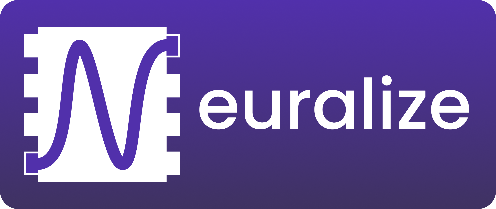

<h1 align="center">
    
      
    EdgeLLM
</h1>

<h4 align="center">
    LLM inference library for mobile devices
</h4>

    <a href="https://runlocal.ai">Website</a> |
    <a href="https://runlocal.ai#contact">Contact</a> |
    <a href="https://discord.gg/y9EzZEkwbR">Discord</a> |
    <a href="https://x.com/Neuralize_AI">Twitter</a> |
    <a href="https://neuralize-ai.github.io/edgerunner">Docs</a>
      
    
    

# Building and installing

See the [BUILDING](BUILDING.md) document.

# Contributing

See the [CONTRIBUTING](CONTRIBUTING.md) document.

# Licensing

<!--
Please go to https://choosealicense.com/licenses/ and choose a license that
fits your needs. The recommended license for a project of this type is the
Boost Software License 1.0.
-->
